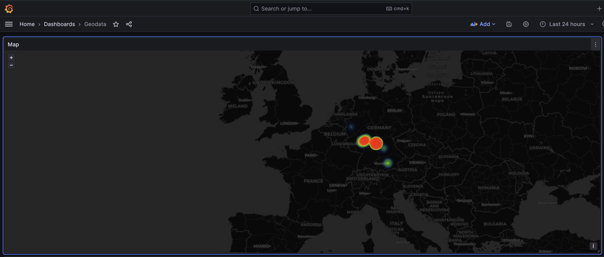

# Logs with geo
Ingest and enrich logs with geoip information (country, city, latitude, longitude).

The original idea here was to enrich my [apache](https://httpd.apache.org/) logs for [Loki](https://grafana.com/oss/loki/) so that I could use the Geomap view for my logs in [Grafana](https://grafana.com/).

The script also supports nginx access logs and other similar log formats.

## Setup on the server
1. Get the GeoLite-City.mmdb from MaxMind GeoIP and store it to the `geoip-db` folder.
2. Install requirements as root `python3 -m pip install -r requirements.txt` because we'll run it as a root service later (dedicated user to be added)

### first run
Prepare two sample log files: sample-logs/access.log and sample-logs/other_vhosts_access.log

Attempt a first run like this

	python3 main.py -o sample-logs/all_with_geoip.log -f sample-logs/access.log -f sample-logs/other_vhosts_access.log -i -1

### service
modify the logs-with-geo.service and maybe add something like this

	StandardOutput = append:/opt/custom/logs-with-geo/errors.log
	ExecStart      = python3 /opt/custom/logs-with-geo/main.py -o /var/log/apache2/all_with_geoip.log -f /var/log/apache2/access.log -f /var/log/apache2/other_vhosts_access.log

Then install the service as usual (move the file to the services folder and start, enable, check status)

Watch all_with_geoip.log grow with added geo data (eg with `tail -f all_with_geoip.log`!

## Integration tests
Just run `make testa` to test all

## Simulate behaviour (manual testing)
prepare these files:
- other_vhosts_access.log <- should be empty
- other_vhosts_access.orig.log <- should contain some log lines (at least 100 for more fun)

run this in one window:

	cd sample-logs
	./log_faker.sh other_vhosts_access.orig.log other_vhosts_access.log

and this in another

    python3 main.py -o sample-logs/all_with_geoip.log -f sample-logs/access.log -f sample-logs/other_vhosts_access.log

Then watch the sample-logs/all_with_geoip.log grow with added geo data!
